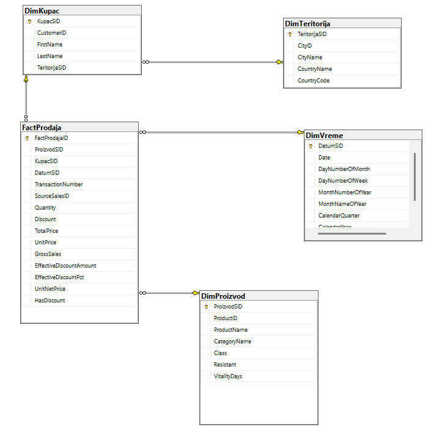
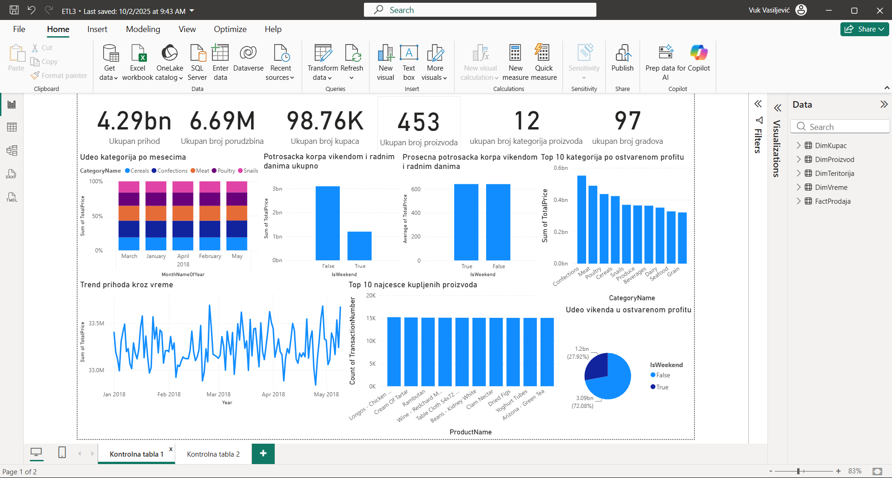
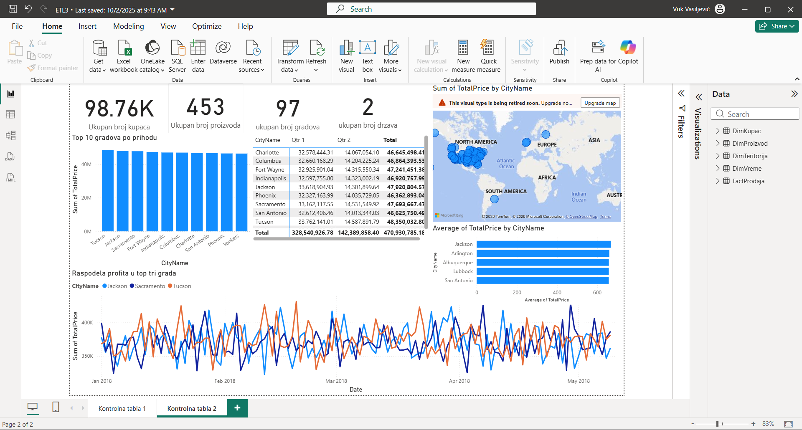

# Grocery Sales Data Warehouse & Business Intelligence

End-to-end Business Intelligence project developed as part of the **ETL and Data Warehousing** course at the Faculty of Organizational Sciences, University of Belgrade.

The project demonstrates the complete process of transforming operational retail data into a dimensional data warehouse and using it for analytical reporting.

## Project Overview

The source system contains grocery retail transactions together with information about products, customers, categories, cities and countries.

The project covers the complete BI workflow:

1. Analysis of the OLTP source system
2. Dimensional data warehouse design
3. Development of SSIS ETL packages
4. Loading dimensions and the fact table
5. Creation of calculated sales measures
6. Power BI reporting and business analysis

## Technologies

- Microsoft SQL Server
- SQL Server Integration Services (SSIS)
- Visual Studio / SQL Server Data Tools
- Dimensional Modeling
- ETL
- Power BI
- Business Intelligence
- Data Warehousing

## Data Warehouse Model

The warehouse follows a dimensional model centered around the sales fact table.

### Dimensions

- **DimProizvod** — Product
- **DimKupac** — Customer
- **DimTeritorija** — Territory
- **DimVreme** — Date

### Fact Table

- **FactProdaja** — Sales fact table

The fact table represents individual sales line items and connects the dimensions used for analytical reporting.



## SSIS ETL Process

The SSIS project contains separate ETL packages for loading each dimension and the sales fact table:

- `DimProizvod.dtsx`
- `DimKupac.dtsx`
- `DimTeritorija.dtsx`
- `DimVreme.dtsx`
- `TabelaCinjenica.dtsx`

The project also contains:

- `PaketSekvencijalnogIzvrsavanja.dtsx`

which orchestrates the complete ETL process by loading the dimensions before the fact table.

## Derived Measures

Several additional measures are calculated during the ETL process, including:

- Gross Sales
- Effective Discount Amount
- Effective Discount Percentage
- Unit Net Price
- Discount Indicator

Detailed SSIS expressions are available in:

[`docs/derived-columns.md`](docs/derived-columns.md)

## Power BI Reporting

Two Power BI dashboard pages were developed on top of the data warehouse.

### Sales Performance Dashboard

The first dashboard analyzes overall sales performance, product categories, revenue trends and differences between weekday and weekend sales.



### Territory Analysis Dashboard

The second dashboard focuses on geographic sales performance and compares revenue and purchasing behavior across cities and territories.



## Business Questions

The project was designed to answer three main business questions:

- Does product category affect total revenue?
- Is revenue higher during weekends or weekdays?
- Does customer territory affect purchasing behavior?

## Key Findings

The analysis showed that:

- Product categories have a significant impact on total revenue.
- Confections, Meat and Poultry were among the strongest categories in the analyzed dataset.
- Approximately 72% of revenue was generated during weekdays, while weekends accounted for approximately 28%.
- Geographic differences in customer spending were visible across cities and territories.

## Dataset

The project uses the Grocery Sales Dataset available on Kaggle.

Dataset information is available in:

[`data/README.md`](data/README.md)

The raw database backup files are not included because of their large size.

## Repository Structure

```text
data/
    Dataset information

docs/
    Full project report
    ETL calculated-column documentation

power-bi/
    Power BI report documentation

screenshots/
    Dashboard and data warehouse previews

ssis/
    Visual Studio SSIS solution and ETL packages
```

## Full Documentation

The complete university project report is available here:

[`docs/project-report.pdf`](docs/project-report.pdf)

## Author

Vuk Vasiljević

Faculty of Organizational Sciences  
University of Belgrade
